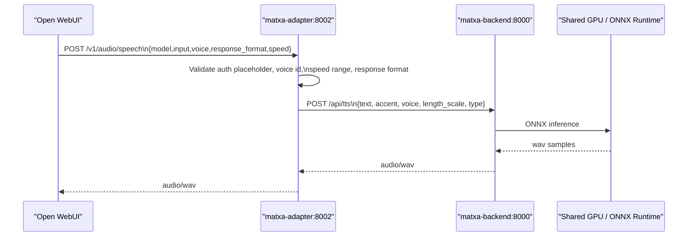

# feat: Add Matxa OpenAI-compatible TTS stack

## Overview

Add a production-only Catalan TTS path for Open WebUI by introducing a Matxa backend service plus a small OpenAI-compatible adapter. The design keeps Open WebUI unchanged, preserves the repo's base/local/prod compose split, and makes the GPU-vs-CPU backend choice explicit because the current upstream BSC service does not enable CUDA by default.

## Problem Frame

The current stack serves chat and image workloads but has no premium Catalan TTS path. The requested behavior is for Open WebUI to call an OpenAI-style `/v1/audio/speech` endpoint while the actual synthesis runs on the BSC Matxa stack. In this repository, GPU-backed services are isolated in `docker-compose.prod.yml`, and production lifecycle is driven by `Makefile` plus `scripts/ops.sh`, so the TTS integration has to fit those patterns rather than bolting on ad hoc containers. The plan also has to account for two repo-specific constraints discovered during research:

- the public `langtech-bsc/minimal-tts-api` upstream already exposes `/api/tts`, `/health`, `/v1/models`, and `/v1/audio/speech`, but its current implementation is CPU-only unless we maintain a minimal CUDA-enabling variant
- host port `8002` is already reserved in this repo by `vllm-quality`, so `matxa-adapter` cannot safely publish `8002:8002` in production without conflicting with an existing profile

## Requirements Trace

- R1. Open WebUI must be able to use Matxa through an OpenAI-compatible TTS endpoint with no frontend code changes.
- R2. The adapter must expose `POST /v1/audio/speech`, `GET /v1/audio/voices`, and `GET /health`.
- R3. The adapter must translate OpenAI-style `voice` and `speed` fields into the BSC `/api/tts` contract, including strict voice validation and `length_scale = 1.0 / speed`.
- R4. The production stack must add `matxa-backend` and `matxa-adapter` on the existing Docker network with `restart: unless-stopped` and health-driven startup sequencing.
- R5. `matxa-backend` must support a recommended GPU-backed path while preserving a strict-upstream CPU fallback path because the upstream service is currently CPU-only.
- R6. Models and downloads must persist across restarts so first-run downloads are cached.
- R7. The repo's operational workflow must stay `make`-driven rather than relying on manual `docker compose` usage.
- R8. Documentation must cover Open WebUI configuration, GPU contention caveats, and licensing/distribution caveats.

## Scope Boundaries

- No changes to Open WebUI frontend code or UI flows.
- No changes to LiteLLM routing for chat or embeddings.
- No attempt to make Matxa part of the model-switcher mode machine in phase 1.
- No guaranteed local-Mac parity for Matxa; this plan is production-first because the requested backend depends on NVIDIA GPU semantics.
- No voice inventory beyond the eight voices in the request.
- No commercial license clearance work beyond documenting the dependency and flagging distribution review.

## Context & Research

### Relevant Code and Patterns

- `docker-compose.yml` is intentionally minimal and backend-agnostic; it defines core services and the shared default network `ai_default`.
- `docker-compose.prod.yml` is where GPU workloads and production-only services live today, including `vllm-*`, `comfyui`, `model-switcher`, and production healthchecks.
- `scripts/ops.sh` is the real orchestration layer for `make up`, `make down`, `make ps`, `make logs`, `make doctor`, and smoke tests. `BASE_SERVICES`, `MODEL_SERVICES`, and `COMPOSE_SERVICES` determine what actually starts.
- `Makefile` is a thin façade over `scripts/ops.sh`; new operator-facing checks should follow that pattern instead of inventing separate Docker commands.
- `control/app.py` and `admin/app.py` show the repo's current Python/FastAPI/Flask service style: simple environment-driven apps with explicit health endpoints and narrow responsibilities.

### Institutional Learnings

- No `docs/solutions/` material exists yet for this area, so the plan should lean on repo conventions and explicit external references rather than assumed local precedent.

### External References

- Docker Compose GPU reservations docs confirm `deploy.resources.reservations.devices` with `driver`, `count`, and `capabilities: [gpu]`, and note that `count` and `device_ids` are mutually exclusive.
- Open WebUI's current OpenAI-compatible documentation confirms TTS support is wired through an OpenAI-style base URL and model string, and that `/v1/audio/speech` is the relevant endpoint for TTS.
- `langtech-bsc/minimal-tts-api` upstream currently documents `POST /api/tts` and, in its public source, also exposes `/health`, `/v1/models`, and `/v1/audio/speech`.

## Key Technical Decisions

- **Keep Matxa service definitions in `docker-compose.prod.yml` instead of `docker-compose.yml`:** this repo already treats GPU-backed inference as a production override concern. Putting Matxa there preserves the existing base/local/prod split and avoids breaking local-only setups that cannot satisfy NVIDIA requirements.
- **Start Matxa as part of `BASE_SERVICES`, not `MODEL_SERVICES`:** `scripts/ops.sh` only `create`s model services but `up`s base services. Because TTS should remain available independently of which LLM profile is active, both `matxa-backend` and `matxa-adapter` belong in the always-on service set.
- **Keep a dedicated adapter even though upstream already exposes `/v1/audio/speech`:** the adapter still earns its keep by enforcing the exact voice IDs requested, validating `speed`, normalizing error messages, ignoring auth/model fields for OpenAI compatibility, and insulating Open WebUI from upstream API drift.
- **Implement two backend variants and recommend the CUDA-enabled one:** the strict-upstream variant preserves the public BSC service unchanged but remains CPU-only; the recommended variant applies a minimal pinned patch to enable CUDA provider selection while preserving the upstream HTTP contract.
- **Do not bind `matxa-adapter` to host port `8002`:** `docker-compose.prod.yml` already uses host `8002` for `vllm-quality`. The safest production shape is to keep container port `8002` internal and, if host-side smoke access is still desired, publish an alternate host port such as `127.0.0.1:8012:8002`.
- **Leave Open WebUI TTS configuration as an application-level step for phase 1:** the repo already uses container env vars for core chat wiring, but the requested rollout explicitly configures TTS in the Open WebUI admin panel. Documenting that flow is safer than coupling this first pass to potentially version-sensitive Open WebUI env behavior.

## Open Questions

### Resolved During Planning

- **Should the Matxa services live in base compose or prod compose?** Prod compose. This matches the repo's existing architecture for GPU-backed inference and avoids forcing local environments to carry Matxa-specific assumptions.
- **How should the backend GPU requirement be reconciled with the upstream BSC repo being CPU-only today?** Carry two supported variants in the plan: `cuda-patched` as the recommended production path, `upstream-cpu` as a fallback or validation path.
- **Can `matxa-adapter` publish `8002:8002` as requested?** Not in this repo's current production layout. Host `8002` is already assigned to `vllm-quality`, so the adapter should stay internal-only or publish on a different host port while keeping internal port `8002`.
- **Should the adapter talk to the backend's `/v1/audio/speech` or `/api/tts` endpoint?** `/api/tts`. It is the stable upstream synthesis contract described in the request and avoids adapter-to-adapter semantics.

### Deferred to Implementation

- **Exact upstream pin:** choose the exact upstream commit SHA or tag at implementation time after validating the current public repo still matches the researched contract.
- **Whether the adapter also needs `GET /v1/models`:** Open WebUI TTS does not require it per the requested flow, but implementation can add a tiny compatibility endpoint if smoke testing reveals a model-probe dependency in the target Open WebUI version.
- **Whether CPU fallback on CUDA OOM should be explicit or passive:** the plan assumes phase 1 will rely on ONNX Runtime behavior plus the CPU fallback variant, but the exact retry strategy depends on real runtime observations.
- **Whether to vendor upstream source or clone it during image build:** this is an implementation packaging choice that should be decided based on reproducibility and deployment ergonomics once the build path is exercised.

## High-Level Technical Design

> *This illustrates the intended approach and is directional guidance for review, not implementation specification. The implementing agent should treat it as context, not code to reproduce.*



Variant handling for `matxa-backend`:

- `cuda-patched` (recommended): upstream HTTP contract preserved, runtime patched to allow CUDA execution provider selection
- `upstream-cpu` (fallback): pure upstream behavior, no source modification, lower performance and no GPU use

## Alternative Approaches Considered

- **Point Open WebUI directly at upstream `minimal-tts-api`:** rejected for phase 1 because it would couple Open WebUI to upstream voice parsing, omit the requested `/v1/audio/voices` contract, and leave `speed` mapping and error normalization outside our control.
- **Route TTS through LiteLLM:** rejected because the current need is a narrow audio proxy, not multi-provider TTS brokering, and adding LiteLLM to the path would increase moving parts without solving the voice-contract problem.
- **Integrate Matxa into the model-switcher mode lifecycle immediately:** deferred because phase 1 can tolerate Matxa as a small always-on GPU consumer, while switcher integration would enlarge scope into cross-service GPU orchestration.

## Implementation Units

- [ ] **Unit 1: Package the Matxa backend with explicit CPU and GPU variants**

**Goal:** Introduce a reproducible `matxa-backend` service that preserves the upstream HTTP contract while making the CPU-vs-GPU runtime choice explicit.

**Requirements:** R4, R5, R6, R8

**Dependencies:** None

**Files:**
- Create: `matxa-backend/Dockerfile`
- Create: `matxa-backend/patches/0001-enable-cuda-provider.patch`
- Create: `matxa-backend/README.md`
- Test: `tests/matxa/test_backend_contract.sh`

**Approach:**
- Build a local wrapper image for `langtech-bsc/minimal-tts-api` pinned to a known upstream ref.
- Support two selectable variants:
  - `upstream-cpu`: installs and runs upstream unchanged.
  - `cuda-patched`: applies a small patch that swaps to `onnxruntime-gpu` and reads runtime provider selection from env while leaving `/api/tts` and `/health` unchanged.
- Mount a persistent cache volume for Hugging Face downloads and model assets so cold starts do not re-download models on every restart.
- Keep the service internal-only on port `8000` and use `/health` for healthchecks because the upstream source exposes that endpoint explicitly.

**Technical design:** *(directional guidance, not implementation specification)*

```text
build variant -> fetch pinned upstream -> optional patch apply -> install runtime deps
runtime env -> choose CPU or CUDA provider -> expose unchanged upstream HTTP endpoints
```

**Patterns to follow:**
- `control/Dockerfile`
- GPU-service shape in `docker-compose.prod.yml`

**Test scenarios:**
- Health endpoint returns success for both variants.
- `/api/tts` accepts a valid Catalan request and returns `audio/wav`.
- Cache volume survives container restart and avoids re-download behavior.
- GPU variant fails fast with a descriptive error if CUDA runtime is unavailable instead of silently presenting itself as GPU-backed.

**Verification:**
- An implementer can start `matxa-backend`, see a healthy container, and synthesize a short Catalan phrase with the documented upstream contract in both variants.

- [ ] **Unit 2: Build the OpenAI-compatible Matxa adapter**

**Goal:** Implement the `matxa-adapter` FastAPI service that translates OpenAI-style TTS calls into the BSC backend contract.

**Requirements:** R1, R2, R3, R4

**Dependencies:** Unit 1

**Files:**
- Create: `matxa-adapter/Dockerfile`
- Create: `matxa-adapter/requirements.txt`
- Create: `matxa-adapter/main.py`
- Test: `matxa-adapter/tests/test_main.py`

**Approach:**
- Expose `POST /v1/audio/speech`, `GET /v1/audio/voices`, and `GET /health`.
- Hardcode the requested eight voice IDs and map each to `{accent, voice}` pairs expected by `/api/tts`.
- Validate `speed` in the OpenAI range `0.25-4.0` and compute `length_scale = 1.0 / speed`.
- Ignore `Authorization` content, `model`, and any extra OpenAI-style fields that are irrelevant for Matxa, but preserve OpenAI-compatible request/response ergonomics.
- Proxy backend failures as meaningful `4xx/5xx` responses rather than collapsing everything to generic 500s.
- Default to `audio/wav`, reject unsupported `response_format` values clearly, and keep the adapter stateless.

**Execution note:** Start with failing contract tests for voice mapping, speed validation, and backend error propagation.

**Patterns to follow:**
- `control/app.py`
- `admin/app.py`

**Test scenarios:**
- `central-grau` maps to `accent=central`, `voice=grau`.
- Unknown voice IDs return `400` with a descriptive message.
- `speed=1.5` becomes a backend `length_scale` near `0.67`; `speed=0.75` becomes `1.33`.
- Out-of-range speed values return `400`.
- Backend timeout or `5xx` is surfaced as a clear adapter error.
- `/v1/audio/voices` returns exactly the eight requested voices.

**Verification:**
- A mocked-backend test suite proves the adapter emits the expected upstream payloads and returns OpenAI-compatible HTTP responses.

- [ ] **Unit 3: Integrate Matxa services into production compose and operational commands**

**Goal:** Wire `matxa-backend` and `matxa-adapter` into the existing production lifecycle so operators can manage them through the repo's normal `make` workflow.

**Requirements:** R4, R5, R6, R7

**Dependencies:** Unit 1, Unit 2

**Files:**
- Modify: `docker-compose.prod.yml`
- Modify: `scripts/ops.sh`
- Modify: `Makefile`
- Modify: `.env.example`
- Test: `tests/matxa/test_ops_tts_smoke.sh`

**Approach:**
- Add both services to `docker-compose.prod.yml` on the existing default network.
- Configure `matxa-backend` with:
  - internal port `8000`
  - `restart: unless-stopped`
  - healthcheck on `/health`
  - persistent model cache volume
  - GPU reservation using `deploy.resources.reservations.devices` with `driver: nvidia`, `count: 1`, and `capabilities: [gpu]` for the recommended variant
  - `CUDA_VISIBLE_DEVICES=0` and optional `ORT_CUDA_VISIBLE_DEVICES`
- Configure `matxa-adapter` with:
  - container port `8002`
  - `depends_on` health condition for `matxa-backend`
  - `MATXA_BACKEND_URL=http://matxa-backend:8000`
  - `restart: unless-stopped`
  - either no host publish or a non-conflicting host port such as `127.0.0.1:8012:8002`
- Update `scripts/ops.sh` so both Matxa services are included in `BASE_SERVICES` and `COMPOSE_SERVICES`, but not `MODEL_SERVICES`.
- Extend `cmd_deploy` so production deploys rebuild `matxa-backend` and `matxa-adapter` alongside the existing locally built services; otherwise Matxa code changes would fall outside the repo's normal deployment path.
- Add a dedicated TTS smoke command through `scripts/ops.sh` and `Makefile` rather than overloading the current LLM/comfy smoke test semantics.

**Patterns to follow:**
- Healthcheck and restart conventions in `docker-compose.prod.yml`
- Command façade style in `Makefile`
- `cmd_test` / `cmd_doctor` structure in `scripts/ops.sh`

**Test scenarios:**
- `make up` starts both Matxa services alongside the existing base stack.
- `make ps` and `make logs TARGET=matxa-adapter` expose the new services through existing operational flows.
- TTS smoke test returns `audio/wav` for the Catalan reference sentence.
- The stack still starts cleanly with `qwen-fast`, `qwen-quality`, and `comfy` profiles available.

**Verification:**
- Operators can manage Matxa entirely through `make`, and a dedicated smoke check proves end-to-end synthesis without manual Docker commands.

- [ ] **Unit 4: Document deployment, Open WebUI setup, and runtime caveats**

**Goal:** Make the new TTS path operable by documenting configuration steps, expected ports, GPU-sharing behavior, and licensing caveats.

**Requirements:** R1, R7, R8

**Dependencies:** Unit 3

**Files:**
- Modify: `README.md`
- Create: `docs/runbooks/matxa-tts.md`

**Approach:**
- Document that Matxa is a production-only addition in this repo's current shape.
- Capture the Open WebUI admin settings flow with the internal URL `http://matxa-adapter:8002/v1`, placeholder API key, default model `tts-1`, and recommended default voice.
- Document the intentional host-port deviation from `8002:8002` if implementation keeps the adapter internal-only or remaps it to avoid the existing `vllm-quality` conflict.
- Record the first-request warmup behavior, GPU contention caveat with the single-GPU stack, and the CPU fallback variant.
- Flag licensing/distribution review as an explicit operational prerequisite before shipping beyond internal/non-commercial use.

**Patterns to follow:**
- Repo operational style in `README.md`

**Test scenarios:**
- Documentation walkthrough lets an operator configure Open WebUI TTS without inspecting source code.
- Runbook includes one known-good Catalan phrase and expected success outcome.

**Verification:**
- A teammate unfamiliar with the feature can enable TTS from the runbook and complete a smoke request successfully.

## System-Wide Impact

- **Interaction graph:** TTS traffic bypasses LiteLLM and the model-switcher control path; Open WebUI talks directly to `matxa-adapter`, which talks directly to `matxa-backend`.
- **Error propagation:** Adapter validation errors should stay `400`; backend unavailability should surface as an upstream dependency failure instead of pretending the request succeeded.
- **State lifecycle risks:** The only durable state introduced is model/cache storage. No Postgres or Open WebUI schema changes are required.
- **API surface parity:** Chat, embeddings, and image-generation paths stay untouched. The only new externally visible API surface is the adapter if a host port is published.
- **Integration coverage:** Cross-layer smoke coverage needs to include both `llm` mode and `comfy` mode because Matxa becomes a third GPU-aware service in a repo that previously modeled GPU ownership as LLM-vs-Comfy.
- **Deployment path:** Matxa will be locally built service code, not just pulled images, so the repo's `deploy` flow must rebuild it explicitly to avoid stale containers after source changes.

## Risks & Dependencies

- **Upstream GPU mismatch:** the public BSC backend is CPU-only today. Mitigation: keep a strict-upstream fallback path and make the recommended CUDA path a minimal pinned patch rather than an invasive fork.
- **Host port collision on `8002`:** `vllm-quality` already claims that host port in production. Mitigation: keep adapter internal-only or remap host exposure to a different port while preserving internal `8002`.
- **Single-GPU contention with model-switcher assumptions:** Matxa introduces a small always-on GPU-capable service into a stack that currently assumes exclusive LLM/comfy switching. Mitigation: keep Matxa lightweight, document the risk, and defer switcher integration unless real contention warrants it.
- **Build-time dependency on upstream GitHub and model downloads:** wrapping upstream at build time can make deploys sensitive to network or upstream drift. Mitigation: pin an upstream ref and document vendoring as a fallback if reproducibility becomes painful.
- **Deploy drift risk:** if `cmd_deploy` is not updated, Matxa source edits would not rebuild during the standard production deploy flow. Mitigation: include both Matxa services in the explicit deploy build list and cover that path in smoke verification.
- **Licensing ambiguity for redistribution:** the request notes GPL/non-commercial constraints and asks to verify upstream licensing before distribution. Mitigation: make license verification an explicit rollout prerequisite and avoid claiming commercial-ready packaging in phase 1.

## Dependencies / Prerequisites

- NVIDIA runtime available on the production host.
- A pinned reachable upstream ref for `langtech-bsc/minimal-tts-api`.
- Persistent storage path for Matxa model/cache data on the production host.
- Open WebUI admin access to configure TTS settings after deployment.

## Documentation / Operational Notes

- The reference smoke phrase should be: `La seva gerra sembla molt antiga i el viatge fou molt llarg.`
- The recommended default Open WebUI voice is `central-grau`.
- If a host-published adapter port is retained for smoke testing, prefer loopback binding rather than broad external exposure.
- `make deploy` should remain the canonical rebuild path for Matxa in production; avoid documenting any manual Docker rebuild workflow that bypasses `scripts/ops.sh`.
- If runtime contention appears in production, the first low-risk mitigation is to switch Matxa to the CPU fallback variant temporarily rather than redesigning model-switcher immediately.

## Sources & References

- Related code: `docker-compose.yml`
- Related code: `docker-compose.prod.yml`
- Related code: `scripts/ops.sh`
- Related code: `Makefile`
- Related code: `control/app.py`
- External docs: [Docker Compose GPU support](https://docs.docker.com/compose/how-tos/gpu-support/)
- External docs: [Open WebUI OpenAI-compatible provider guide](https://github.com/open-webui/docs/blob/main/docs/getting-started/quick-start/connect-a-provider/starting-with-openai-compatible.mdx)
- External docs: [langtech-bsc/minimal-tts-api](https://github.com/langtech-bsc/minimal-tts-api)
